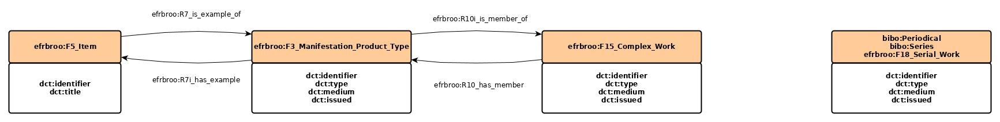
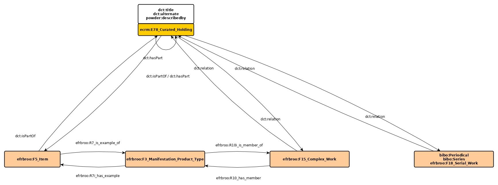
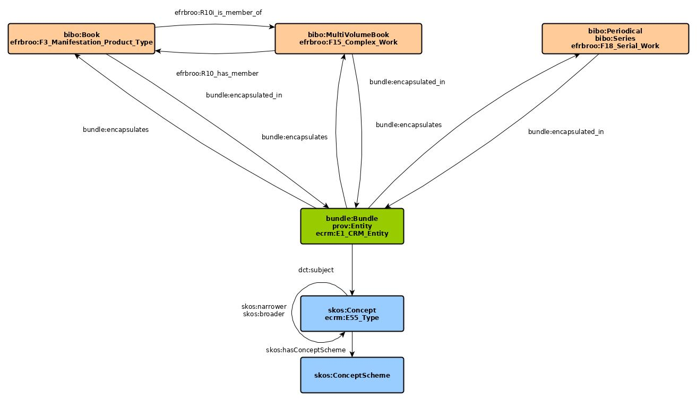
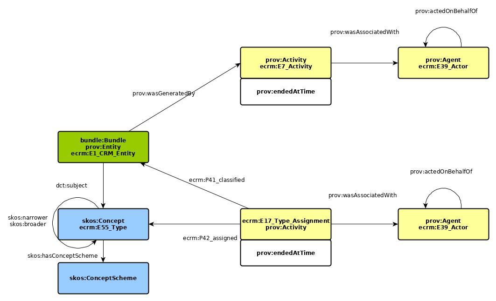

# Ein _Application Profile_ für die Abdeckungsanalyse des Bestands der UB Dortmund mit RVK-Notationen

**Dipl.-Math. Hans-Georg Becker (M.L.I.S.)**\
ORCID iD https://orcid.org/0000-0003-0432-294X

Technische Universität Dortmund\
Universitätsbibliothek\
Informationssysteme und Datenmanagement\
https://www.ub.tu-dortmund.de

**Version**\
1.0 - Initiale Version - 2020-05-24

**License**


This work is licensed under a [Creative Commons Attribution 4.0 International License](https://creativecommons.org/licenses/by/4.0/).

## Einleitung

Für das Projekt, eine nach inhaltlichen Kriterien aufbereitete Navigation für den Katalog der UB 
Dortmund zu erstellen, wurde neben einer geeigneten Universalklassifikation auch eine Sammlung von 
Quellen für die Datenübernahme gesucht. Nach der Entscheidung für die Regensburger 
Verbundklassifikation (RVK), wurden die Daten des Projektes CultureGraph der Deutschen 
Nationalbibliothek (koordiniert durch die Arbeitsgemeinschaft Kooperative Verbundanwendungen, vgl. 
auch \[1\]) als geeignete Kandidaten angesehen.

Das CultureGraph-Projekt hat zum Ziel einen Dienst zur Anreicherung mit inhaltserschließenden Daten 
in den Verbundsystemen und der DNB zu implementieren. 

Das vorliegende Dokument stellt das Verfahren vor, wie die Abdeckungsanalyse des Bestands der UB 
Dortmund mit RVK-Notationen durch CultureGraph-Daten erfolgte.

Die Herausforderung bei der Analyse ist die Vereinigung von Daten aus mehreren unterschiedlichen 
Quellen zur Analyse. Die Notwendigkeit zur Nutzung weiterer Quellen neben CultureGraph ergibt sich 
zum einen daraus, dass die Daten in CultureGraph „nur“ die Bündelinformation der Verbundaufnahmen 
als Ids und die daraus resultierenden inhaltserschließenden Elemente sowie Autorendaten enthalten. 
Weitere bibliographische Daten sind nicht enthalten. Zum anderen werden zur Analyse auch lokale 
Bestandsdaten und Daten zur lokalen Aufstellungssystematik sowie die RVK selber benötigt.

Als Quellen werden somit verwendet:

* Abzug der CultureGraph-Daten vom September 2019
* die Linked Data-Repräsentation der hbz-Verbunddaten via lobid.org \[2\]
* die RVK als SKOS-Vokabular \[3\]
* die lokale Aufstellungssystematik \[4\]
* lokale Bestandsdaten ausdem Bibliothekssystem SISIS Sunrise

Die Daten lagen teilweise bereits als RDF-Daten vor bzw. sollten im Rahmen des Projektes in eine 
RDF-Version überführt werden. 

Für die Abdeckungsanalyse verwenden wir das CIDOC CRM als Referenzontologie, da sich hier flexible 
Abfragen an die aggregierten Daten modellieren lassen.

## Referenzontologie versus Anwendungsontologie

Die Herausforderung, mehrere unterschiedlich modellierte Datenquellen zu vereinen und abfragbar zu machen, 
mündet in der Anforderung, eine geeignet abstrahierte Ontologie zu finden, die die notwendigen Fragestellungen 
auch beantworten kann. Anstatt nun eine Ontologie für diesen Zweck zu entwickeln, setzt das in diesem Beitrag 
vorgestellte Application Profile auf das CIDOC CRM.

Beim CIDOC Conceptual Reference Model handelt es sich um eine Norm für den kontrollierten 
Austausch von Informationen im Bereich des kulturellen Erbes\[5\]. Die Ontologie soll unter anderem von Archiven, 
Bibliotheken und Museen zur Verbesserung der Verfügbarkeit von Wissen angewandt werden. Es wurde vom CIDOC, 
einem der 30 internationalen Komitees des International Council of Museums (Internationalen Museumsrats, ICOM) 
entwickelt.

Mit dem CIDOC CRM wird das Ziel verfolgt, die vielfältigen Informationen im Bereich des kulturellen Erbes 
gemeinsam zu erfassen und einen allgemeinen Rahmen ihrer formalen Semantik zur Verfügung zu stellen, damit 
jede Information dieses Bereichs den Begriffen des CIDOC CRM zugeordnet werden kann. Auf diese Weise werden 
wichtige Voraussetzungen für die Informationsintegration geschaffen, da auf der Grundlage des CIDOC CRM 
Werkzeuge zur Schematransformation und -integration entwickelt werden können.

Das CRM beruht auf zwei Hierarchien von Entitäten und Eigenschaften und erlaubt ein hohes Maß an semantischer 
Präzision. Es eignet sich daher als eine Art Zwischenformat, dessen Verwendung die Anzahl der notwendigen 
Mappings dramatisch reduziert, wenn verschiedene Quellformate und mehrere Zielsprachen benötigt werden. Die 
wichtigste Eigenschaft des CIDOC CRM ist allerdings die Ereigniszentriertheit, d.h. es wird davon ausgegangen, 
dass jedes Objekt nur dann existiert, wenn vorher ein Ereignis stattgefunden hat, welches das Objekt zum Resultat
hat.

Das CRM erlaubt Mappings beliebiger Datenmodelle. Für einige der im Bereich des kulturellen Erbes einschlägigen
Modelle liegen generische Mappings vor, die von den Entwicklern des CRM veröffentlicht wurden. Im Rahmen dieses 
Projektes wird die Erweiterung FRBRoo verwendet.  

FRBRoo\[6\] ist die objektorientierte Version der Functional Requirements for Bibliographic Records (FRBR) und 
ermöglicht die gemeinsame Darstellung von Bibliotheks- und Museumsdokumentation. Damit ist es möglich, 
interoperable Informationssysteme für alle Nutzerinnen und Nutzer zu implementieren, die ein Interesse daran 
haben, auf gemeinsame oder verwandte Inhalte kultureller Einrichtungen zuzugreifen.

FRBRoo fügt damit den FRBR die dynamischen Aspekte des CRM hinzu (vgl. auch \[7\] für eine 
Betrachtung von Ereignissen in bibliographischen Metadaten mittels FRBRoo). Ferner erlaubt es, aufgrund der 
netzartigen Struktur des CRM, bibliographische Informationen in Linked Data Kontexte zu übertragen.

Die Ontologien des CIDOC CRM-Universums haben über die Jahre eine enorme Komplexität und einen hohen 
Abstraktionsgrad erreicht. Daher eignet sich das CIDOC CRM eigentlich "nur noch" in der Verwendung als 
Referenzontologie, zu der konkrete Anwendungsontologien in Beziehung gesetzt werden (vgl. auch \[8\]).
In diesem Sinne ist es möglich, ein _Application Profile_ auf Basis des CIDOC CRM zu definieren, welches 
allgemein im Retrieval bzw. konkret im Fall der Abdeckungsanalyse in diesem Beitrag durch das CIDOC CRM als 
Referenzontologie nutzbar wird.

## Aspekte für das Application Profile

### Bestandsdaten

Die Bestandsdaten der UB Dortmund werden aus zwei Quellen zusammengestellt. Für die "Titeldaten", also die 
Manifestationen im FRBR-Sinn, sind dies die hbz-Verbunddaten in der Linked Data-Repräsentation von lobid.org. 
Die Exemplardaten kommen aus dem Bibliothekssystem SISIS Sunrise, da hier auch "echte" Standortdaten zur 
Verfügung stehen, die im Verbund fehlen. Die Standortdaten sind insbesondere für die Verknüpfung zu den 
Sammlungen notwendig (siehe nächster Abschnitt).

Die Daten werden im _Application Profile_ mittels _Erlangen-FRBRoo (efrbroo)_\[9\] modelliert. Beim Erlangen-FRBRoo handelt 
es sich um eine Umsetzung der FRBRoo. Hier kommt dann auch _Erlangen-CRM (ecrm)_\[10\] zum Einsatz. 
Zusätzlich sind sogenannte _Instance Allignments_ zur _Bibliographic Ontology (bibo)_\[11\] durch die 
lobid.org-Daten enthalten.
Für die spätere Analyse der Daten werden hier folgende Metadaten ins Modell übernommen (beschrieben mit _Dublin 
Core Terms (dct)_\[12\]):

* Medientyp (dct:medium) für die Angabe, ob es sich um eine gedruckte oder digitale Manifestation handelt
* Publikationsdatum (dct:issued), um die Erschließung aktuellster Literatur zu beurteilen
* Publikationstyp (dct:type), um nach Erscheinungsformen zu unterscheiden

Zusätzlich wird mit dct:identifier die ID der Manifestation erfasst, die dann zugleich die ID des 
Bundle-Mitglieds ist.

Bei den Exemplaren (efrbroo:F5_Item) werden Mediennummer (dct:identifier) und Signatur (dct:title) erfasst.

Die Modellierung von Zeitschriften und Reihen nimmt hier eine Sonderrolle ein, die sich in der Modellierung 
dieser Publikationsformen in FRBRoo begründet. Kernkonzept ist bei "fortlaufenden Sammelwerken", dass sie 
sich als Ganzes erst manifestieren, wenn diese nicht mehr fortlaufend und somit abgeschlossen sind. 
Manifestationen können daher im Normalfall nur Hefte und im späteren Verlauf Jahrgänge oder, im Fall der 
Reihen, Bände sein. 
Daher werden Datensätze zu Zeitschriften und Reihen als FRBRoo-Werke, _F18_Serial_Work_, modelliert. Da diese 
Publikationsformen somit keine Exemplare im FRBR-Sinne haben, in Bibliotheken aber trotzdem Signaturen 
vergeben werden, stellen diese hier nur eine einfache Relation zu den Sammlungen dar (und nicht wie die 
Exemplare im Sinne von _is part of_.

Auch die Darstellung von mehrbändig begrenzten Werken weicht von der zu den "einfachen" Exemplaren ab. 
Hierbei wird berücksichtigt, dass bei mehrbändig begrenzten Werken die inhaltliche Erschließung 
situationsabhängig mal bei den Bänden und mal bei den Überordnungen erfolgt sein kann.

 

Bilddatei: [img/Datenmodell_virtuelle_Systematik_Holdings.jpg](img/Datenmodell_virtuelle_Systematik_Holdings.jpg)

### Lokale Aufstellungssystematik

Die Aufstellungssystematik der UB Dortmund ist proprietär und hat sich über die Jahre - nicht immer zum Guten - 
weiter entwickelt. Der wesentliche Charakter der Systematik erschließt sich über die unterschiedlichen Philosphien 
der Bibliotheksstandorte. Während in der Zentralbibliothek hauptsächlich Freihandaufstellung, Lehrbuchsammlung 
und Dissertationen sowie gebundene Zeitschriftenjahrgänge bereitgestellt wurden, sind aktuelle Forschungsliteratur 
und Zeitschriftenhefte sowie besondere Bestände als Präsenzbestand in den Bereichsbibliotheken räumlich nah an den 
Fakultäten untergebracht. Hieraus resultiert auch eine unterschiedliche Aufstellungssystematik: die Zentralbibliothek 
mit grober Fachaufteilung und Numerus Currens, die Bereichsbibliotheken mit mehr oder weniger ausgefeilter 
Fachaufstellung.

Jedoch wurden die Ergbnisse dieser Erschließung nur als Signaturen und nicht als Titelangaben erfasst. Dieses 
Prinzip ist unproblematisch, solange es mit anderen Standorten keine Dubletten gibt. Insbesondere fehlt den 
Bänden in der Zentralbibliothek unter diesen Umständen die feinere fachliche Zuordnung, so dass die 
Systemstellen nur unzureichend zu einem guten Retrievalergebnis beitragen können.  

Hinzu kommt, dass sich die Systematik an einigen Stellen an formalen und nicht an inhaltlichen Kriterien orientiert
(z.B. eine riesige nicht weiter untergliederte Systemstelle "Sammelwerke").

Für die Modellierung der Aufstellungssystematik im Projekt zur Abdeckungsanalyse mit RVK-Notationen wurde daher
auf den Charakter der Zuordnung der Bestände eher als physische Sammlungen anstatt auf thematische Kollektionen
gesetzt. Die Bestände werden folglich als Sammlungen (_Collections_) und nicht mitels einer Klassifikation im
Sinne von SKOS beschreiben.

 

Bilddatei: [img/Datenmodell_virtuelle_Systematik_Collections.jpg](img/Datenmodell_virtuelle_Systematik_Collections.jpg)

### Culture Graph

Die Daten aus CultureGraph (CG) liegen aktuell nicht als RDF-Daten sondern als MARC-Auszug vor. 
Für die Dantenanalyse werden die Werk-Cluster aus CG mittels der Bundle-Ontologie\[13\] und die einzelnen
die Bündelmitglieder mittels Erlangen-FRBRoo beschrieben.  

Die Tatsache, dass in den üblichen Bibliothekskatalogen die beiden FRBR-Klassen "Work" und "Expression" (WE) 
nicht abgebildet werden (die Bibliothekskataloge erfassen Manifestationen und als Bestandsverzeichnis noch 
die Exemplare; das Regelwerk RDA lässt auch die anderen Klassen zu, jedoch werden diese insbesondere nicht 
retrospektiv erfasst), hat zur Folge, dass für das FRBR-Modell nicht alle Entitäten vorhanden sind. Die für 
die Abdeckungsanalyse notwendigen inhaltserschließenden Elemente aus CultureGraph müssten aber bei den „Works“ 
erfasst werden.

Die Nutzung von CIDOC CRM und FRBRoo als Referenzontologie ermöglicht es nun, auf die Abdeckungsanalyse die 
FRBR-Klassen "Work" und "Expression" zu verzichten und diese durch die CG-Bundles „zu ersetzen“. 

Die für unsere Zwecke relevanten Daten zur inhaltlichen Erschließung werden mittels SKOS\[14\] modelliert und an 
die Klassen des CIDOC CRM im Application Profile angehängt. 

 

Bilddatei: [img/Datenmodell_virtuelle_Systematik_CG-Bundle_plus_Subjects.jpg](img/Datenmodell_virtuelle_Systematik_CG-Bundle_plus_Subjects.jpg)

### Provenienz
 
Die CultureGraph-Daten enthalten auch Angaben zur Provenienz der Bündel. Diese Daten werden ebenfalls modelliert, 
wobei die PROV-Ontologie\[15\] des W3C zu Einsatz kommt. Bei den CG-Bündeln ist zu beachten, dass deren ID/URIs 
nicht über die Datenlieferungen persistent sind, womit diese den Charakter von Snapshots erhalten. Die Darstellung
der Provenienz mittels PROV-Ontologie ermöglicht es aber, genau diesen Sachverhalt darzustellen.

Es wird hier modelliert, dass ein _Concept_ mittels eines Ereignisses dem CG-Bundle zugeordnet wird. Auch hier 
kommt die PROV-Ontologie zum Einsatz.



Bilddatei: [img/Datenmodell_virtuelle_Systematik_CG-PROV.jpg](img/Datenmodell_virtuelle_Systematik_CG-PROV.jpg)

**Beispiel:** Bundle zur Manifestation HT011238108 inkl. Software als Agent (prov:Agent) und Datum des Snapshots (prov:endedAtTime)**

Die SPARQL-Query 

```
PREFIX lobid_r: <http://lobid.org/resources/>
PREFIX bundle: <http://purl.org/net/bundle#>
PREFIX prov: <http://www.w3.org/ns/prov#>

SELECT * WHERE {
    lobid_r:HT011238108 bundle:encapsulated_in ?bundle .
    ?bundle prov:wasGeneratedBy ?activity.
    ?activity prov:endedAtTime ?timestamp .
    ?activity prov:wasAssociatedWith ?software .
    ?software prov:actedOnBehalfOf ?on_behalf_of .
}
```
liefert 

| bundle:Bundle | prov:Activity | ?timestamp | prov:SoftwareAgent | prov:Agent (on_behalf_of) | 
|-----------------------|----------------------|--------------------------------------------|--------------------|-----------------| 
| cg_bundle:CG_4995116> | activity:CG_4995116> | "2019-06-05T13:19:42.548Z"^^<xsd#dateTime> | agent:CG_4995116> | lobid_org:DE-101 | 

**Beispiel:** Ausschnitt der inhaltserschließenden Elemente zur Manifestation HT011238108 inkl. Provenienzangaben

Die SPARQL-Query

```
PREFIX lobid_r: <http://lobid.org/resources/>
PREFIX bundle: <http://purl.org/net/bundle#>
PREFIX ecrm: <http://erlangen-crm.org/current/>
PREFIX prov: <http://www.w3.org/ns/prov#>
PREFIX dct: <http://purl.org/dc/terms/>

SELECT * WHERE {
    lobid_r:HT011238108 bundle:encapsulated_in ?bundle .
    ?bundle ecrm:P41i_was_classified_by ?activity .
    ?activity ecrm:P42_assigned ?concept .
    ?activity prov:wasAssociatedWith ?agent .
    OPTIONAL { ?activity dct:description ?description . }
}
```
liefert

| bundle:Bundle | prov:Activity | skos:Concept | prov:Agent | dct:description        | 
|----------------------|------------------------------------------------------|-------------------|-------------------|---------------------| 
| cg_bundle:CG_4995116 | activity:DE-601_308533771                            | sdnb:18           | lobid_org:DE-601  |                     | 
| cg_bundle:CG_4995116 | activity:DE-576_083062696                            | rvk:QC310         | lobid_org:DE-576  |                     | 
| cg_bundle:CG_4995116 | activity:DE-576_083062696                            | gnd:4122827-3     | lobid_org:DE-576  |                     | 
| cg_bundle:CG_4995116 | activity:DE-603_084860006                            | rvk:QV000         | lobid_org:DE-603  |                     | 
| cg_bundle:CG_4995116 | activity:DE-604_BV012931983                          | rvk:QV200         | lobid_org:DE-604  |                     | 
| cg_bundle:CG_4995116 | activity:DE-101_1167375963                           | sdnb:330          | lobid_org:DE-101  |                     | 
| cg_bundle:CG_4995116 | activity:DE-101_1167375963                           | gnd:4002737-5     | lobid_org:DE-101  |                     | 
| cg_bundle:CG_4995116 | activity:DE-101_e8e1bcbb-1e03-4e57-abbd-571f4d12fc2c | gnd:4002730-2     | lobid_org:DE-101  | maschinell gebildet | 
| cg_bundle:CG_4995116 | activity:DE-101_d38816a3-8664-4224-9ee6-8401c431b08e | gnd:4002733-8     | lobid_org:DE-101  | maschinell gebildet | 


## Beispiele für Analyseabfragen

### Beispiel: RVK-Notationen zu einem Exemplar in der Emil-Figge-Bibliothek (EFB)

Das Exemplar hat die Signatur "AA 600/5". 

SPARQL-Query:

```
PREFIX dct: <http://purl.org/dc/terms/>
PREFIX rdf: <http://www.w3.org/1999/02/22-rdf-syntax-ns#>
PREFIX ecrm: <http://erlangen-crm.org/current/>
PREFIX efrbroo: <http://erlangen-crm.org/efrbroo/>
PREFIX lobid_r: <http://lobid.org/resources/>

SELECT DISTINCT ?shelfmark ?item ?manifestation ?bundle ?rvk WHERE { 
    ?item dct:title "AA 600/5" .
    ?item dct:title ?shelfmark .
    ?item rdf:type efrbroo:F5_Item .
    ?item efrbroo:R7_is_example_of ?manifestation .
    ?manifestation <http://purl.org/net/bundle#encapsulated_in> ?bundle .
    ?bundle dct:subject ?rvk .
}
```

Das Ergebnis befindet sich in der Tabelle [data/AA_600_5.tsv](data/AA_600_5.tsv).

### Beispiel: Anzahl von RVK-erschlossenen Manifestationen zu Exemplaren einer Sammlung in der EFB.

Gesucht wird die Anzahl an Titeln aus der Sammlung "Musik" (MU) der Emil-Figge-Bibliothek (EFB), 
für die aus CultureGraph RVK-Notationen zu holen sind.

SPARQL-Query:

```
PREFIX dct: <http://purl.org/dc/terms/>
PREFIX rdf: <http://www.w3.org/1999/02/22-rdf-syntax-ns#>
PREFIX efrbroo: <http://erlangen-crm.org/efrbroo/>

SELECT ?label (COUNT(distinct ?work) AS ?cnt) WHERE {
    <http://data.ub.tu-dortmund.de/resource/collection:DE-290-12:MU> dct:hasPart ?collection .    
    ?collection rdf:type dct:Collection .
    ?collection dct:alternative ?label .
    ?item dct:isPartOf ?collection .
    ?item efrbroo:R7_is_example_of ?work .
    ?work <http://purl.org/net/bundle#encapsulated_in> ?bundle .
    FILTER EXISTS { ?bundle dct:subject ?rvk . }
}
GROUP BY ?collection ?label
ORDER BY ?label
```

Das Ergebnis befindet sich in der Tabelle [data/EFB_MU.tsv](data/EFB_MU.tsv).


### Inhaltserschließende Elemente zu einer Manifestation eines Exemplars

Das Exemplar hat die Signatur "F 73317". 

SPARQL-Query:

```
PREFIX dct: <http://purl.org/dc/terms/>
PREFIX rdf: <http://www.w3.org/1999/02/22-rdf-syntax-ns#>
PREFIX ecrm: <http://erlangen-crm.org/current/>
PREFIX efrbroo: <http://erlangen-crm.org/efrbroo/>
PREFIX lobid_r: <http://lobid.org/resources/>

SELECT DISTINCT ?shelfmark ?item ?manifestation ?bundle ?subject ?score ?prov WHERE { 
    ?item dct:title "F 73317" .
    ?item dct:title ?shelfmark .
    ?item rdf:type efrbroo:F5_Item .
    ?item efrbroo:R7_is_example_of ?manifestation .
    ?manifestation <http://purl.org/net/bundle#encapsulated_in> ?bundle .
    ?bundle ecrm:P41i_was_classified_by ?subject_activity .
    ?subject_activity ecrm:P42_assigned ?subject .
    OPTIONAL { ?subject_activity rdf:value ?score . ?subject_activity dct:description ?prov . }
}
```

Das Ergebnis befindet sich in der Tabelle [data/F_73317.tsv](data/F_73317.tsv).


## Fazit

Aufgabe war es, unterschiedlichste Quelldaten für eine Abdeckungsanalyse mit RVK-Notationen für
die Bestände der UB Dortmund so zu strukturieren, dass möglichst flexibel Abfragen, aber auch 
Anpassungen vorgenommen werden können. Der Linked Data-Ansatz mit dem CIDOC CRM als Referenzontologie
hat sich dabei bewährt.

Allerdings ist der Aufwand bei der Umssetzung nicht zu unterschätzen, da die Daten nur in geringem Maße
bereits als Lined Data vorliegen und zunächst transformiert werden müssen. Zusätzlich sind selbst
die Daten, die als Linked Data vorliegen, nicht mittels SPARQL abfragbar, so dass auch diese Daten
lokal vorgehalten werden müssen und somit den lokalen Speicherbedarf nochmals erhöht.

Die Ergebnisse der Abdeckungsanalyse können kurz zusammengefasst als sehr vielversprechend bezeichnet werden.
Detailergebnisse sind auf GitHub \[17\] veröffentlicht.

**TODO**

* CIDOC CRM als Referenzontologie hat die gewünschte Flexibilität gebracht
* Die lobid.org-Daten liegen zwar als Linked Data vor, sind jedoch nicht über einen SPARQL-Endpoint nutzbar. 
Dadurch stehen sie nicht für den dezentralisierten Ansatz zur Datennutzung mittels der 
Federated SPARQL\[16\]-Technologie zur Verfügung. Dieser Umstand zwingt uns dazu, einige Metadaten in der 
eigenen GraphDB vorzuhalten.
* Ergebnisse der Abdeckungsanalyse kurz zusammengefasst; Details in GitHub-Projekt: 

## Quellenverzeichnis

\[1\] Röschlau, Edith: Bericht aus der 75. Sitzung der Arbeitsgemeinschaft der Verbundsysteme am 20. und 21. November 2018 in Frankfurt am Main. 
In: o-bib. Das offene Bibliotheksjournal. - 2019, Vol. 6, Heft 1, S. 66 - 72. 
DOI: [https://doi.org/10.5282/o-bib/2019H1S66-72](https://doi.org/10.5282/o-bib/2019H1S66-72).  (zuletzt abgerufen: 24.05.2020)

\[2\] [https://lobid.org/resources](https://lobid.org/resources) (zuletzt abgerufen: 24.05.2020)

\[3\] [https://rvk.uni-regensburg.de/regensburger-verbundklassifikation-online/rvk-download](https://rvk.uni-regensburg.de/regensburger-verbundklassifikation-online/rvk-download) (zuletzt abgerufen: 24.05.2020)

\[4\] [https://github.com/UB-Dortmund/ubdo_shelf_marks_classification_scheme](https://github.com/UB-Dortmund/ubdo_shelf_marks_classification_scheme) (zuletzt abgerufen: 24.05.2020)

\[5\] [http://www.cidoc-crm.org/](http://www.cidoc-crm.org/) (zuletzt abgerufen: 24.05.2020)

\[6\] [http://www.cidoc-crm.org/frbroo/](http://www.cidoc-crm.org/frbroo/) (zuletzt abgerufen: 24.05.2020)

\[7\] Becker, Hans-Georg; Förster, Frank : Vernetztes Wissen – Ereignisse in der bibliografischen Dokumentation
In: Zeitschrift für Bibliothekswesen und Bibliographie. - 2010, Vol. 57, Heft 1, S. 15 - 25.
DOI: [http://dx.doi.org/10.3196/186429501057133](http://dx.doi.org/10.3196/186429501057133) (zuletzt abgerufen: 24.05.2020)

\[8\] Hohmann, Georg: Die Anwendung des CIDOC CRM für die semantische Wissensrepräsentation in den Kulturwissenschaften. 
In: Ohly, Peter; Sieglerschmidt, Jörn (eds.): Wissensspeicher in digitalen Räumen. Nachhaltigkeit, Verfügbarkeit, semantische Interoperabilität. Proceedings der 11. Tagung der Deutschen Sektion der Internationalen Gesellschaft für Wissensorganisation Konstanz 20.-22. Februar 2008. 
Würzburg, 2010: Ergon. pp. 210-222.

\[9\] Erlangen-FRBRoo: [http://erlangen-crm.org/efrbroo](http://erlangen-crm.org/efrbroo)  (zuletzt abgerufen: 24.05.2020)

\[10\] Erlangen-CRM: [http://erlangen-crm.org/](http://erlangen-crm.org/)  (zuletzt abgerufen: 24.05.2020)

\[11\] Bibliographic Ontology: [https://github.com/structureddynamics/Bibliographic-Ontology-BIBO](https://github.com/structureddynamics/Bibliographic-Ontology-BIBO)  (zuletzt abgerufen: 24.05.2020)

\[12\] DCMI Metadata Terms: [https://dublincore.org/specifications/dublin-core/dcmi-terms/](https://dublincore.org/specifications/dublin-core/dcmi-terms/) (zuletzt abgerufen: 24.05.2020)

\[13\] Bundle-Ontologie: Eine Beschreibung der Ontologie findet sich unter [http://openbiblio.net/2010/11/17/bundling-instances-of-author-names-together-without-using-owlsameas/](http://openbiblio.net/2010/11/17/bundling-instances-of-author-names-together-without-using-owlsameas/) (zuletzt abgerufen: 24.05.2020). Leider ist eine öffentliche RDF/OWL-Version aktuell nicht existent.

\[14\] SKOS: [https://www.w3.org/TR/skos-reference/](https://www.w3.org/TR/skos-reference/) (zuletzt abgerufen: 24.05.2020)

\[15\] PROV: [https://www.w3.org/TR/prov-o/](https://www.w3.org/TR/prov-o/) (zuletzt abgerufen: 24.05.2020)

\[16\] SPARQL Federated Query: [https://www.w3.org/TR/sparql11-federated-query/](https://www.w3.org/TR/sparql11-federated-query/) (zuletzt abgerufen: 24.05.2020)

\[17\] [https://hagbeck.github.io/Abdeckung-mit-RVK-Notationen-via-CultureGraph/](https://hagbeck.github.io/Abdeckung-mit-RVK-Notationen-via-CultureGraph/) (zuletzt abgerufen: 24.05.2020)


